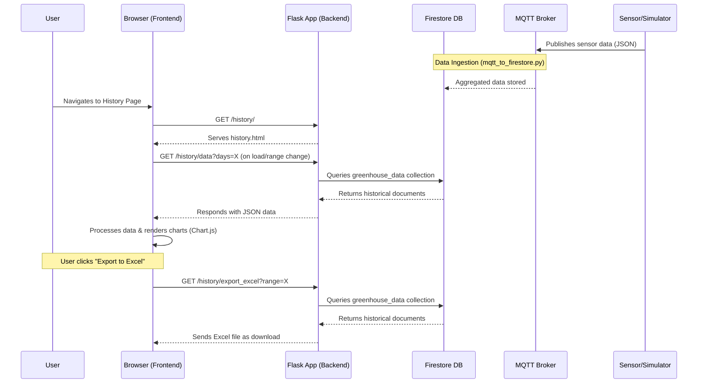

<!--
Section Naming Convention Update (as of recent changes):
- 'Penyemaian' is now referred to as 'Peremajaan'.
- 'Remaja' is now referred to as 'Meja Apung'.
This document reflects these updated names.
-->
# Greenhouse Monitoring: History Page Implementation

## 1. Introduction

This document details the implementation of the "Data Riwayat" (History Page) for the Lokatani Greenhouse Monitoring system. This page allows users to visualize and analyze historical sensor data, including temperature, humidity, and light intensity, collected from various sections of the greenhouse.

**Key Features:**

*   **Multi-Sensor Visualization:** Displays separate, interactive line charts for Temperature, Humidity, and Light Intensity.
*   **Time Range Selection:** Users can select predefined time ranges:
    *   1 Jam (1 Hour)
    *   24 Jam (24 Hours / 1 Day)
    *   7 Hari (7 Days)
    *   30 Hari (30 Days)
*   **Data Insights:** For each sensor type and selected range, the page displays:
    *   Minimum value (with section and timestamp)
    *   Maximum value (with section and timestamp)
    *   Overall average value for the period.
*   **Responsive Design:** Charts and layout adapt to different screen sizes.
*   **Localization:** UI elements are partially localized to Bahasa Indonesia.
*   **Dynamic Data Loading:** Data is fetched asynchronously from a backend API.
*   **Data Export:** Users can export historical data for selected time ranges (1 Hour, 24 Hours, 7 Days, and 30 Days) to an Excel file. The 7-day export provides data aggregated into 10-minute intervals, and the 30-day export provides data aggregated into hourly intervals.

## 2. System Architecture & Data Flow

The history feature involves several components working together:



### 2.1. Data Ingestion (External Script)

*   **Source:** `Hardware/simulation/mqtt_to_firestore.py`
*   **Process:**
    1.  Subscribes to an MQTT topic where raw sensor data is published.
    2.  Aggregates readings (temperature, humidity, light) for each greenhouse section (`peremajaan`, `meja_apung`, `dewasa`, `averages`) over a defined interval (e.g., 1 minute).
    3.  Calculates statistics (average, min, max, median, count) for the aggregated data.
    4.  Saves these statistics as a new document in the `greenhouse_data` collection in Firestore. Each document is timestamped (UTC).

### 2.2. Backend (Flask Application)

*   **Relevant Files:**
    *   `blueprints/history/routes.py`: Defines API endpoints and page rendering logic.
    *   `blueprints/history/firestore.py`: Handles interaction with Firestore for fetching data.
*   **API Endpoint: `GET /history/data`**
    *   **Purpose:** Provides historical sensor data to the frontend.
    *   **Query Parameters:**
        *   `days` (integer, optional, default: `7`): Specifies the number of past days of data to retrieve. The "1hour" frontend range still requests 1 day of data from this API, with client-side filtering.
    *   **Processing:**
        1.  Queries the `greenhouse_data` collection in Firestore.
        2.  Filters documents based on the `days` parameter (timestamps within the range).
        3.  Converts UTC timestamps from Firestore to WIB (Asia/Jakarta) ISO 8601 strings.
    *   **Response:** Returns a JSON object:
        ```json
        {
          "success": true,
          "data": [
            {
              "timestamp": "YYYY-MM-DDTHH:MM:SS+07:00", // WIB
              "data": { // Contains 'stats' from Firestore document
                "dewasa": {
                  "temps": { "avg": 25.5, "min": 24.0, ... },
                  "humidities": { "avg": 60.1, ... },
                  "lights": { "avg": 5000, ... }
                },
                "meja_apung": { /* ... */ },
                "peremajaan": { /* ... */ },
                "averages": { /* ... */ }
              }
            }
            // ... more data points
          ]
        }
        ```

### 2.3. Frontend (Browser)

*   **Relevant Files:**
    *   `templates/history.html`: Main HTML structure for the page.
    *   `static/js/history.js`: Core JavaScript logic for interactivity, data fetching, processing, and chart rendering.
    *   `static/js/history_export.js`: JavaScript logic for handling the "Export to Excel" button functionality.
    *   `static/css/history.css`: Styles specific to the history page.
*   **Process:**
    1.  **Page Load:** Renders `history.html`.
    2.  **Initialization (`history.js`):**
        *   Sets up event listeners for time range buttons.
        *   Initializes empty Chart.js instances for temperature, humidity, and light.
        *   Triggers an initial data load for the default time range (24 Hours).
        *   Sets up the "Export to Excel" button, initially enabling/disabling it based on the default range.
    3.  **Data Fetching & Processing:**
        *   `loadHistoricalData()`:
            *   Requests data from the `/history/data` API.
            *   Displays loading indicators.
        *   `processSensorData()`:
            *   Receives raw API data and processes it for each sensor type (`temps`, `humidities`, `lights`).
            *   Handles client-side filtering for the "1hour" range.
            *   Performs downsampling for the "1day" range.
            *   Ensures that data points corresponding to true Min/Max values (for insights) are included in the data sent to the chart, especially for "1day", "7day", and "30day" ranges.
            *   Calculates insights (min, max, overall average).
    4.  **Chart Rendering & Insight Display:**
        *   `updateGenericChart()`: Updates the respective Chart.js instance with processed data, configuring datasets, labels, colors, and X-axis time scale.
        *   `updateGenericInsights()`: Populates the HTML elements with calculated min, max, and average values.

## 3. Detailed Frontend Implementation (`static/js/history.js`)

### 3.1. Core Components & Variables

*   **Chart Instances:** `temperatureChart`, `humidityChart`, `lightChart` (global Chart.js objects).
*   **`currentSelectedRange`:** String variable tracking the active time range (e.g., "1hour", "1day").
*   **`chartColors`:** Object mapping greenhouse section names (e.g., `dewasa`) to specific colors for chart lines.

### 3.2. Initialization (`DOMContentLoaded`)

1.  `setupTimeRangeButtons()`: Attaches click event listeners to time range buttons. On click:
    *   Updates the active button's style.
    *   Sets `currentSelectedRange`.
    *   Calls `loadHistoricalData()` to refresh charts.
    *   Calls `updateExportButtonState()` (from `history.js`, see section 3.8) to enable/disable the export button.
2.  `initTemperatureChart()`, `initHumidityChart()`, `initLightChart()`:
    *   Get the canvas context for each chart.
    *   Create a new `Chart` instance with initial (empty) data and options.
    *   Configure:
        *   `type: 'line'`.
        *   `responsive: true`, `maintainAspectRatio: false`.
        *   X-axis: `type: 'time'`, title "Waktu".
        *   Y-axis: Specific titles (e.g., "Suhu (°C)", "Kelembaban (%)", "Intensitas Cahaya (lux)") and `beginAtZero` settings where appropriate (e.g., `true` for light).
        *   Plugins: Legend position, tooltip behavior.
3.  `loadHistoricalData(currentSelectedRange)`: Initiates the first data load.

### 3.3. Data Loading and Orchestration (`loadHistoricalData`)

1.  Displays a global loading indicator.
2.  Clears any previously displayed insights for all three charts using `update<Sensor>Insights(null)`.
3.  Determines `daysToFetchAPI` based on `selectedRange` (1 day for "1hour", or the number of days for "Xday").
4.  Fetches data from `/history/data?days=<daysToFetchAPI>`.
5.  Upon receiving a successful API response:
    *   For each sensor type (`temps`, `humidities`, `lights`):
        *   Calls `processSensorData(apiResponse.data, selectedRange, <sensorType>)` to get processed chart data and insights.
        *   Calls `update<Sensor>Chart()` to render the chart.
        *   Calls `update<Sensor>Insights()` to display min/max/avg.
        *   Calls `checkAndShowNoDataError()` to display a "no data" message if applicable for that specific chart.
6.  Handles API errors or unsuccessful responses by showing an error message.

### 3.4. Data Processing (`processSensorData`)

This is a crucial generic function responsible for transforming raw API data into a format suitable for charting and insights display.

*   **Parameters:** `apiData` (array from backend), `selectedRange` (string), `sensorType` (string: 'temps', 'humidities', 'lights').
*   **Steps:**
    1.  **Insight Calculation Data (`dataForInsightCalculation`):**
        *   If `selectedRange` is "1hour", filters `apiData` to include only data points from the last 60 minutes.
        *   Otherwise, uses the full `apiData` for the selected period.
        *   This dataset is used to find the true min, max, and calculate the overall average for the insights display.
    2.  **True Min/Max Identification:** Iterates through `dataForInsightCalculation` to find the absolute minimum and maximum average values for the given `sensorType` across all sections, along with their timestamps, sections, and original data point objects.
    3.  **Chart Display Data Preparation (`dataForChartDisplayPoints`):**
        *   **"1hour":** Uses the client-side filtered data (last 60 minutes).
        *   **"1day":**
            *   Downsamples `apiData` to roughly 15-minute intervals to reduce the number of points on the chart.
            *   The first and last points of the `apiData` are always included.
        *   **"7day" / "30day":** Starts with the full `apiData` for the period.
    4.  **Ensuring Min/Max Point Visibility (for "1day", "7day", "30day"):**
        *   The `originalPoint` objects corresponding to the `trueMin` and `trueMax` (identified in step 2) are explicitly added to `dataForChartDisplayPoints`.
        *   This list is then de-duplicated (based on timestamp) and sorted chronologically. This ensures that the exact data points shown in the insights are always plotted and interactive on the chart.
    5.  **Final Chart Data Construction:**
        *   Iterates through the `finalDataForChartDisplay` (which is `dataForChartDisplayPoints` after potential modifications).
        *   For each point and each valid section (`dewasa`, `meja_apung`, `peremajaan`, `averages`), extracts the `avg` value for the current `sensorType`.
        *   Formats these as `{ x: DateObject, y: value }` and pushes them into the appropriate arrays within the `chartData` object (e.g., `chartData.dewasa`, `chartData.meja_apung`).
    6.  **Return Value:** Returns an object `{ chartData, insightsData }`.
        *   `chartData`: Data structured for Chart.js datasets.
        *   `insightsData`: Object containing `{ min, max, overallAverage }`.

### 3.5. Chart Rendering (`updateGenericChart`)

*   **Parameters:** `chartInstance`, `chartData` (from `processSensorData`), `selectedRange`, `sensorLabel` (e.g., "Suhu").
*   **Steps:**
    1.  Clears previous datasets from `chartInstance.data.datasets`.
    2.  Iterates through each section in `chartData` (e.g., `dewasa`, `meja_apung`).
    3.  If data exists for the section:
        *   Creates a new Chart.js dataset object with:
            *   `label`: e.g., "Dewasa Suhu".
            *   `data`: The array of `{x, y}` points.
            *   `borderColor`, `backgroundColor` (derived from `chartColors`).
            *   `tension`, `borderWidth`, `pointRadius` (adjusted based on `selectedRange` - smaller/no points for longer ranges).
            *   `fill` (e.g., `true` for 'averages' line).
            *   `order` (to ensure 'averages' line might render on top or bottom as desired).
        *   Pushes the dataset to `chartInstance.data.datasets`.
    4.  **X-axis Time Scale Configuration:** Dynamically adjusts the X-axis `time.unit`, `time.tooltipFormat`, and `time.displayFormats` based on `selectedRange` to optimize label readability (e.g., 'minute' for "1hour", 'hour' for "1day", 'day' for "7day"/"30day").
    5.  Calls `chartInstance.update()` to re-render the chart.

### 3.6. Insights Display (`updateGenericInsights`)

*   **Parameters:** `insights` (from `processSensorData`), `sensorPrefix` (e.g., "Temp", "Humidity", "Light"), `unit` (e.g., "°C", "%", " lux"), and localized label prefixes.
*   **Steps:**
    1.  Gets references to the HTML elements for min value, min subtext, max value, max subtext, avg value, and avg subtext using the `sensorPrefix`.
    2.  If `insights.min` exists, formats and displays the min value and subtext (section and formatted timestamp).
    3.  If `insights.max` exists, formats and displays the max value and subtext.
    4.  If `insights.overallAverage` exists, formats and displays the average value.
    5.  If data is not available for any insight, displays "--" and "Tidak ada data".

### 3.7. UI Feedback

*   `showLoadingState(containerId)`, `hideLoadingState(containerId)`, `showErrorState(containerId, message)`: Helper functions to manage the display of loading messages ("Memuat data...") and error messages within the specified chart container.
*   `checkAndShowNoDataError(containerId, chartData, insightsData)`: Checks if `chartData` is empty for a specific chart and calls `showErrorState` with "Tidak ada data untuk periode terpilih." if needed. Also clears insights for that chart.

## 4. Excel Data Export Feature

This section details the functionality allowing users to export historical sensor data into Microsoft Excel (`.xlsx`) format. This feature provides a convenient way for users to perform offline analysis, create custom reports, or archive data.

### 4.1. Overview

The history page provides dedicated buttons to export data for different time ranges. Depending on the selected range, the data might be raw (at its original collection interval, e.g., per minute) or aggregated to provide a summary over longer periods, keeping file sizes manageable and data interpretation clearer for trends.

### 4.2. Available Export Ranges & Data Aggregation

Four distinct export options are available, each corresponding to a button on the history page:

*   **Export 1 Jam:**
    *   **Data:** Exports raw sensor data recorded within the **last one hour**.
    *   **Interval:** Data is typically at the original sensor reading interval (e.g., every 1 minute).
    *   **Aggregation:** None.
*   **Export 1 Hari:**
    *   **Data:** Exports raw sensor data recorded within the **last 24 hours**.
    *   **Interval:** Data is typically at the original sensor reading interval (e.g., every 1 minute).
    *   **Aggregation:** None.
*   **Export 1 Minggu:**
    *   **Data:** Exports sensor data for the **last 7 days**.
    *   **Interval:** Data is **aggregated into 10-minute intervals**. Each row in the Excel file represents a 10-minute window.
    *   **Aggregation:** Average, Minimum, Maximum, and Count are calculated for each 10-minute interval. The Median is **not** calculated for this export.
*   **Export 30 Hari:**
    *   **Data:** Exports sensor data for the **last 30 days**.
    *   **Interval:** Data is **aggregated into hourly intervals**. Each row in the Excel file represents a one-hour window.
    *   **Aggregation:** Average, Minimum, Maximum, and Count are calculated for each hourly interval. The Median is **not** calculated for this export.

### 4.3. How to Use

1.  Navigate to the "Riwayat Data" (History) page.
2.  Locate the "Ekspor Data ke Excel" section in the header controls.
3.  Click the desired export button:
    *   "Export 1 Jam"
    *   "Export 1 Hari"
    *   "Export 1 Minggu"
    *   "Export 30 Hari"
4.  The system will generate the Excel file, and your browser will prompt you to download it. The filename will indicate the range and the timestamp of generation (e.g., `sensor_data_7day_20231027_143000.xlsx`).

### 4.4. Excel File Structure and Column Explanation

The generated Excel file (`.xlsx`) will contain the following columns. The data in these columns reflects either raw readings or aggregated values depending on the chosen export range.

| Column Header     | Description                                                                                                                                                              | Data Type     | Notes                                                                                                                                       |
| :---------------- | :----------------------------------------------------------------------------------------------------------------------------------------------------------------------- | :------------ | :------------------------------------------------------------------------------------------------------------------------------------------ |
| **Timestamp (WIB)** | The date and time of the sensor reading or the start of the aggregation interval. All timestamps are in Western Indonesian Time (WIB, UTC+7).                             | Date/Time     | For "7 Hari" export, this is the start of a 10-minute interval. For "30 Hari" export, this is the start of an hourly interval.             |
| **Section**         | The specific section within the greenhouse from which the data was recorded. Values can be: `Dewasa`, `Meja Apung`, `Peremajaan`, or `Averages`.                               | Text          | `Averages` refers to the calculated average across all primary sections.                                                                  |
| **Sensor Type**     | The type of environmental parameter being measured. Values can be: `Suhu` (Temperature), `Kelembaban` (Humidity), or `Intensitas Cahaya` (Light Intensity).                 | Text          |                                                                                                                                             |
| **Average**         | The average value of the sensor reading. For raw data exports (1 Hour, 1 Day), this is the direct sensor reading. For aggregated exports (7 Days, 30 Days), this is the calculated average over the interval. | Number        | Units: Suhu (°C), Kelembaban (%), Intensitas Cahaya (lux).                                                                    |
| **Min**             | The minimum value recorded for that sensor. For raw data, this is the same as the Average. For aggregated exports, this is the minimum value observed within the interval. | Number        | Units match the sensor type.                                                                                                                |
| **Max**             | The maximum value recorded for that sensor. For raw data, this is the same as the Average. For aggregated exports, this is the maximum value observed within the interval. | Number        | Units match the sensor type.                                                                                                                |
| **Median**          | The median value of the sensor readings.                                                                                                                                 | Number        | **This column will be BLANK (empty) for "Export 1 Minggu" and "Export 30 Hari"** as median is not calculated for these aggregated exports. |
| **Count**           | The number of raw data points that contributed to this entry. <br> - For **"Export 1 Jam"** and **"Export 1 Hari"**: This value reflects the number of individual sensor readings received and bundled by the `mqtt_to_firestore.py` script during its 1-minute collection cycle for the given timestamp. A count of 31, for example, means 31 raw readings were processed in that minute. <br> - For **"Export 1 Minggu"** and **"Export 30 Hari"**: This indicates how many 1-minute summary readings (from Firestore) were summarized into that interval's statistics (e.g., into a 10-minute or hourly block). | Integer       | This shows the underlying data frequency before aggregation.                                                                                                                                             |

The columns in the Excel sheet are automatically adjusted for width to ensure readability.

### 4.5. Technical Implementation Details

*   **Backend Endpoint:** `GET /history/export_excel`
    *   This Flask route (in `blueprints/history/routes.py`) handles the export requests.
    *   It takes a `range` query parameter ("1hour", "1day", "7day", "30day").
    *   Data is fetched from Firestore using `get_historical_data` (from `blueprints/history/firestore.py`).
    *   For "7day" and "30day" ranges, data aggregation (10-minute or hourly) is performed in Python.
    *   The `openpyxl` library is used to construct the Excel file in memory.
    *   The file is then sent to the client with appropriate headers to trigger a download.
*   **Frontend Interaction:**
    *   `static/js/history_export.js` contains the JavaScript logic for the export buttons.
    *   When a button is clicked, it makes an asynchronous `fetch` request to the `/history/export_excel` endpoint with the corresponding range.
    *   It handles the server's response, initiating the file download if successful, or displaying an alert with an error message if the export fails (e.g., no data available).
    *   The buttons provide visual feedback during the export process (e.g., "Mengekspor...").

## 5. Future Considerations / Potential Enhancements

*   **Per-Chart Loading/Error States:** Currently, a global loading message is shown. Individual loading states for each chart could improve UX.
*   **Custom Date Range Picker:** Allow users to select custom date ranges instead of predefined ones.
*   **Data Export:**
    *   Consider providing an option for "detailed" vs "summary" export for longer ranges if users need finer granularity despite larger file sizes (though current aggregation helps significantly).
    *   Option to export chart data (e.g., as CSV) directly from the chart interface.
---
*This documentation provides a comprehensive guide to the current history page implementation.*
