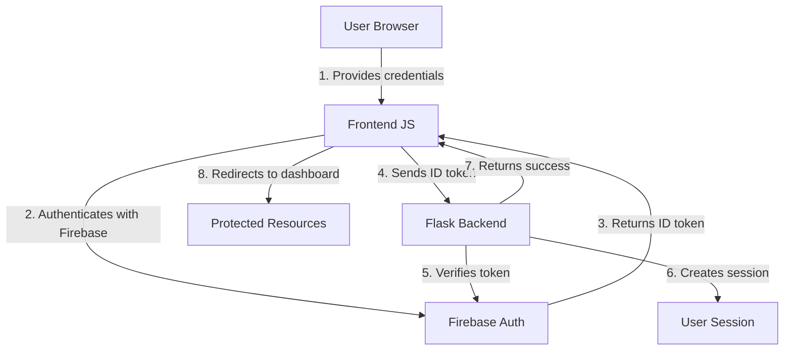

# Lokatech Greenhouse Monitoring - Firebase Authentication Documentation

## Overview
The Lokatech Greenhouse Monitoring application implements a robust authentication system using Firebase Authentication services integrated with a custom Flask backend. This documentation explains how the login, registration, and password management features work together to provide secure user access.

## Table of Contents
1. [Authentication Architecture](#authentication-architecture)
2. [Firebase Configuration](#firebase-configuration)
3. [Security Framework](#security-framework)
4. [Authentication Features](#authentication-features)
   - [Login System](#login-system)
   - [User Registration](#user-registration)
   - [Password Reset](#password-reset)
   - [Account Deletion](#account-deletion)
5. [Technical Implementation](#technical-implementation)
   - [Backend Routes](#backend-routes)
   - [Frontend Components](#frontend-components)
   - [Firebase Methods](#firebase-methods)
6. [Security Considerations](#security-considerations)

## Authentication Architecture

The authentication system employs a hybrid architecture that separates concerns for improved security:



This separation provides several benefits:
- Client-side validation for immediate user feedback
- Server-side verification for security
- Session management for stateful operations
- Token-based authentication for API requests

## Firebase Configuration

Firebase is initialized in two separate places for different purposes:

1. **Frontend Initialization** (`firebase-init.js`):
   - Contains Firebase configuration object with API keys and project settings
   - Initializes Firebase for client-side authentication

2. **Backend Initialization** (`app2.py`):
   - Extracts the Firebase API key from the frontend configuration
   - Initializes Firebase Admin SDK using service account credentials
   - Uses a credential file path that works in both development and production

The system intelligently handles credential paths for different environments:
```python
local_path = os.path.join(os.path.dirname(__file__), "secrets", "firebase-credentials.json")
cloud_path = "/secrets/firebase-credentials.json"
credentials_path = local_path if os.path.exists(local_path) else cloud_path
```

## Security Framework

The system implements multiple layers of security:

1. **Authentication Layer**:
   - Firebase Authentication handles credential verification
   - JWT-based tokens protect against forgery attempts
   - Password complexity requirements enforced

2. **Authorization Layer**:
   - Server-side session validation for all protected routes
   - Role-based access controls
   - Domain restrictions for registration

3. **Data Protection**:
   - Passwords never stored in plaintext (Firebase handles hashing)
   - Sensitive operations require password re-verification
   - Secure password reset workflows

4. **Infrastructure Security**:
   - HTTPS for all communications
   - Firebase service credentials stored securely
   - Environment-aware configuration

## Authentication Features

### Login System

The login system authenticates users with email and password credentials through Firebase, then establishes a session on the backend.

**Login Flow:**
1. User enters email and password on the login page
2. Frontend validates inputs
3. Firebase authenticates credentials and generates ID token
4. Backend verifies ID token and creates user session
5. User is redirected to dashboard upon success

**Key Files:**
- Frontend: `login.html`, `login.js`
- Backend: `blueprints/auth/routes.py`

**Frontend Login Implementation**:
```javascript
// Handle login form submission
document.getElementById('loginForm').addEventListener('submit', async function(e) {
    e.preventDefault();
    const email = document.getElementById('email').value;
    const password = document.getElementById('password').value;
    
    try {
        // Firebase authentication
        const userCredential = await firebase.auth().signInWithEmailAndPassword(email, password);
        const idToken = await userCredential.user.getIdToken();

        // Backend session creation
        const response = await fetch('/auth/login', {
            method: 'POST',
            headers: {
                'Content-Type': 'application/json',
                'Accept': 'application/json'
            },
            body: JSON.stringify({ idToken: idToken })
        });
        
        const data = await response.json();
        if (data.status === 'success') {
            window.location.href = '/dashboard';
        } else {
            // Error handling
            // ...
        }
    } catch (error) {
        // Firebase error handling
        // ...
    }
});
```

**Backend Login Endpoint**:
```python
@bp.route("/login", methods=["POST"])
def login():
    try:
        id_token = request.json['idToken']
        # Verify Firebase token
        google_user = auth.verify_id_token(id_token, clock_skew_seconds=20)

        # Create session
        session['user'] = {
            'email': google_user['email'],
            'name': google_user.get('name', google_user['email'].split('@')[0]),
            'picture': google_user.get('picture', 'default_avatar.png')
        }
        session.modified = True

        logger.info(f"User logged in successfully: {session['user']['email']}")
        return {'status': 'success'}
    except Exception as e:
        logger.error(f"Login failed: {str(e)}")
        return {'status': 'error', 'message': 'Invalid credentials'}, 400
```

### User Registration

The registration system creates new user accounts with domain restrictions, enforcing that only users with approved email domains can register.

**Registration Flow:**
1. User clicks "Register Account" and enters email address
2. Frontend validates domain restrictions
3. Backend creates user in Firebase
4. Frontend triggers password setup email
5. User sets up password via emailed link

**Domain Restrictions:**
- `@lokatani.id` - Lokatani employees
- `@mhsw.pnj.ac.id` - PNJ students (during development)

**Frontend Registration Implementation**:
```javascript
submitRegisterBtn.addEventListener('click', async function() {
    const email = registerEmailInput.value.trim();
    
    // Client-side validation including domain restrictions
    const isLokataniDomain = email.endsWith('@lokatani.id');
    const isPnjDomain = email.endsWith('@mhsw.pnj.ac.id');
    if (!isLokataniDomain && !isPnjDomain) {
        // Show error and return
        // ...
    }
    
    try {
        // Step 1: Create user account via backend
        const backendResponse = await fetch('/auth/register', {
            method: 'POST',
            headers: {
                'Content-Type': 'application/json',
                'Accept': 'application/json'
            },
            body: JSON.stringify({ email: email })
        });

        const backendData = await backendResponse.json();

        if (backendResponse.ok && backendData.status === 'success') {
            // Step 2: Send password setup email
            await firebase.auth().sendPasswordResetEmail(email);
            
            // Show success message
            // ...
        } else {
            // Error handling
            // ...
        }
    } catch (error) {
        // Error handling
        // ...
    }
});
```

**Backend Registration Endpoint**:
```python
@bp.route("/register", methods=["POST"])
def register():
    try:
        data = request.get_json()
        email = data['email'].strip().lower()

        # Server-side validation
        if not re.fullmatch(EMAIL_REGEX, email):
            return jsonify({'status': 'error', 'message': 'Format email tidak valid.'}), 400

        domain = email.split('@')[-1]
        if domain not in ALLOWED_DOMAINS:
            return jsonify({'status': 'error', 'message': f"Pendaftaran hanya diizinkan untuk domain: {', '.join(ALLOWED_DOMAINS)}."}), 400

        try:
            # Create user in Firebase
            firebase_user = auth.create_user(email=email) 
            return jsonify({
                'status': 'success',
                'message': 'Akun berhasil dibuat. Mengirim email pengaturan kata sandi...'
            }), 200
        except auth.EmailAlreadyExistsError:
            return jsonify({'status': 'error', 'message': 'Email ini sudah terdaftar. Silakan coba login atau gunakan fitur lupa kata sandi.'}), 409
        # Other exception handling...
    except Exception as e:
        # General exception handling...
```

### Password Reset

The password reset functionality allows users to regain access to their accounts by receiving a password reset email.

**Password Reset Flow:**
1. User clicks "Forgot password?" link
2. System prompts for email address
3. Firebase sends password reset email
4. User creates new password via emailed link
5. User can log in with new credentials

**Frontend Implementation**:
```javascript
document.getElementById('resetPassword').addEventListener('click', async function(e) {
    e.preventDefault();
    const email = document.getElementById('email').value;
    const errorElement = document.getElementById('error-message');

    if (!email) {
        errorElement.textContent = 'Please enter your email address to reset password';
        return;
    }

    try {
        await firebase.auth().sendPasswordResetEmail(email);
        errorElement.textContent = 'Password reset email sent. Check your inbox.';
        errorElement.style.color = 'green';
    } catch (error) {
        errorElement.textContent = error.message;
    }
});
```

### Account Deletion

The account deletion feature allows users to permanently remove their accounts from the system with proper security verification.

**Account Deletion Flow:**
1. User navigates to profile page and selects "Hapus akun ini"
2. System presents warning message about permanent deletion
3. User must re-enter password for security verification
4. Backend verifies password with Firebase
5. If verified, account is deleted from Firebase
6. User session is cleared and redirected to login page

**Key Files:**
- Frontend: `profile.html`, `profile-page.js`
- Backend: `blueprints/profile/routes.py`

**Frontend Implementation**:
```javascript
function handleDeleteAccount(modal) { 
  const passwordInput = document.getElementById('deleteAccountPassword');
  const confirmButton = document.getElementById('savedeleteAccountModal');
  
  if (!passwordInput || !confirmButton) {
    console.error('Delete account password input or confirm button not found');
    showValidationError('Terjadi kesalahan internal.');
    return;
  }

  const password = passwordInput.value;
    
  if (!password) {
    showValidationError('Silakan masukkan kata sandi Anda untuk konfirmasi');
    return;
  }
  
  // Show loading state
  const originalText = confirmButton.textContent;
  confirmButton.disabled = true;
  confirmButton.textContent = 'Menghapus...';
  
  // Send delete request
  deleteAccount(password)
    .then(data => {
      if (data.status === 'success') {
        showToast('Akun berhasil dihapus');
        setTimeout(() => {
          window.location.href = '/'; // Redirect to login page
        }, 1500);
      } else {
        confirmButton.disabled = false;
        confirmButton.textContent = originalText;
        
        showValidationError(data.message || 'Gagal menghapus akun');
      }
    })
    .catch(error => {
      confirmButton.disabled = false;
      confirmButton.textContent = originalText;
      
      console.error('Error deleting account:', error);
      showValidationError('Terjadi kesalahan saat menghapus akun');
    });
}
```

**Backend Implementation**:
```python
@bp.route("/delete", methods=["POST"])
@isloggedin
def delete_account():
    try:
        data = request.json
        password = data.get('password')
        
        # Security: Validate password is provided
        if not password:
            logger.warning(f"Missing password in delete account attempt: {session['user']['email']}")
            return jsonify({'status': 'error', 'message': 'Kata sandi diperlukan untuk konfirmasi'}), 400
        
        email = session['user']['email']
        
        try:
            # Security: Get Firebase user by email
            firebase_user = auth.get_user_by_email(email)
            
            # Security: Verify password using Firebase REST API
            firebase_api_key = current_app.config.get('FIREBASE_API_KEY')
            if not firebase_api_key:
                logger.error("Firebase API key not configured")
                return jsonify({'status': 'error', 'message': 'Konfigurasi server tidak lengkap'}), 500
            
            # Step 1: Security: Verify password by attempting to sign in
            verify_url = f"https://identitytoolkit.googleapis.com/v1/accounts:signInWithPassword?key={firebase_api_key}"
            verify_data = {
                "email": email,
                "password": password,
                "returnSecureToken": True
            }
            
            verify_response = requests.post(verify_url, json=verify_data)
            
            if not verify_response.ok:
                logger.warning(f"Invalid password in delete account attempt: {email}")
                return jsonify({'status': 'error', 'message': 'Kata sandi tidak valid'}), 401
            
            # Step 2: Delete user account using Firebase Admin SDK
            auth.delete_user(firebase_user.uid)
            
            # Clear user session
            session.clear()
            
            logger.info(f"User account deleted successfully: {email}")
            return jsonify({'status': 'success', 'message': 'Akun berhasil dihapus'})
            
        except auth.UserNotFoundError:
            logger.error(f"User not found in Firebase: {email}")
            return jsonify({'status': 'error', 'message': 'Pengguna tidak ditemukan'}), 404
        except Exception as e:
            logger.error(f"Firebase account deletion error: {str(e)}")
            return jsonify({'status': 'error', 'message': f'Gagal menghapus akun'}), 500
    except Exception as e:
        logger.error(f"Account deletion failed: {str(e)}")
        return jsonify({'status': 'error', 'message': f'Terjadi kesalahan sistem'}), 500
```

## Technical Implementation

### Backend Routes

The backend provides four main authentication endpoints:

1. **Login (`/auth/login`)**: 
   - Verifies Firebase ID token
   - Creates user session
   - Returns success/error status

2. **Logout (`/auth/logout`)**:
   - Clears user session
   - Supports both GET (direct link) and POST (AJAX) methods
   - Returns JSON for AJAX or redirects for direct link

3. **Register (`/auth/register`)**:
   - Validates email format and domain
   - Creates user in Firebase
   - Returns success for frontend to send password setup email

4. **Delete Account (`/profile/delete`)**:
   - Requires password re-verification for security
   - Verifies user credentials with Firebase
   - Permanently deletes user account
   - Clears server-side session

### Frontend Components

1. **Login Form**:
   - Email and password inputs
   - Form submission handling with Firebase
   - Error messaging

2. **Registration Modal**:
   - Email input with domain validation
   - Success/error messaging
   - Modal open/close controls

3. **Password Reset**:
   - "Forgot password?" link trigger
   - Email validation
   - Success/error messaging

4. **Account Deletion**:
   - Confirmation modal with warning
   - Password verification field
   - Success/error handling

### Firebase Methods

Key Firebase methods used in the application:

1. **Authentication**:
   - `firebase.auth().signInWithEmailAndPassword(email, password)`: Authenticates users
   - `userCredential.user.getIdToken()`: Generates ID token for backend verification

2. **User Management**:
   - `auth.create_user(email=email)`: Creates new users (backend)
   - `auth.verify_id_token(id_token)`: Verifies ID tokens (backend)
   - `auth.delete_user(uid)`: Permanently deletes a user account (backend)

3. **Password Management**:
   - `firebase.auth().sendPasswordResetEmail(email)`: Sends password reset emails

## Security Considerations

### 🔐 Authentication Security
- **Multi-layer Verification**: Credentials verified by Firebase and tokens verified by backend
- **Token Protection**: JWT tokens with expiration to prevent replay attacks
- **Password Requirements**: Firebase enforces strong password requirements
- **Brute Force Prevention**: Firebase automatically limits login attempts

### 🛡️ Access Controls
- **Domain Restrictions**: Only approved email domains can register
- **Session Verification**: Every protected route checks for valid session
- **CSRF Protection**: All sensitive operations use POST requests with proper headers

### 🔒 Data Protection
- **Password Handling**: Passwords never stored in plaintext or on backend
- **Re-authentication**: Critical operations (delete account, password change) require password verification
- **Secure Communication**: All API requests use HTTPS

### 📝 Audit & Monitoring
- **Activity Logging**: All authentication activities are logged with timestamp and IP
- **Error Tracking**: Detailed error logging for security investigation
- **Anomaly Detection**: Suspicious activities are logged with warning level
